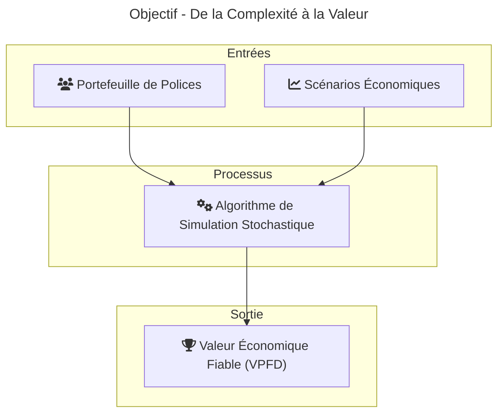
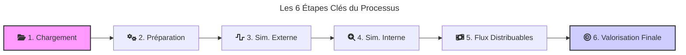
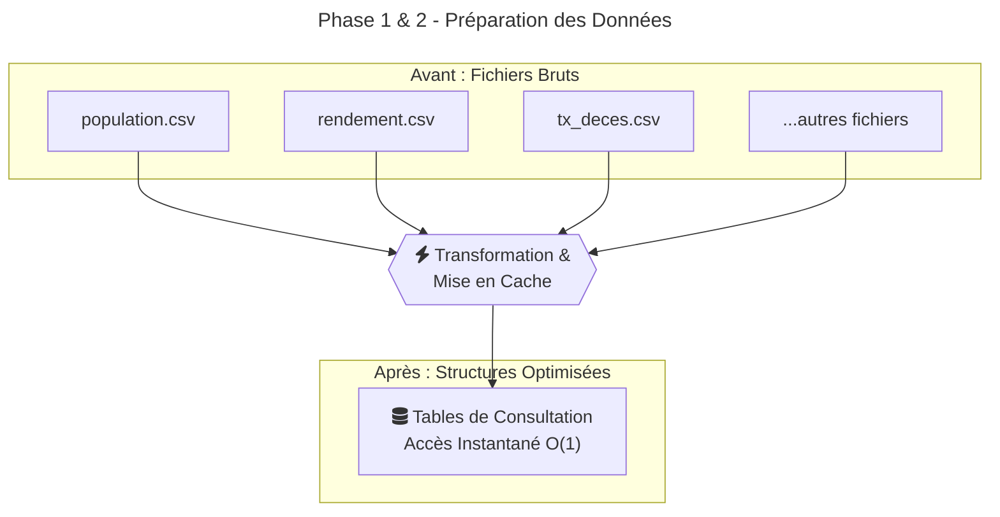
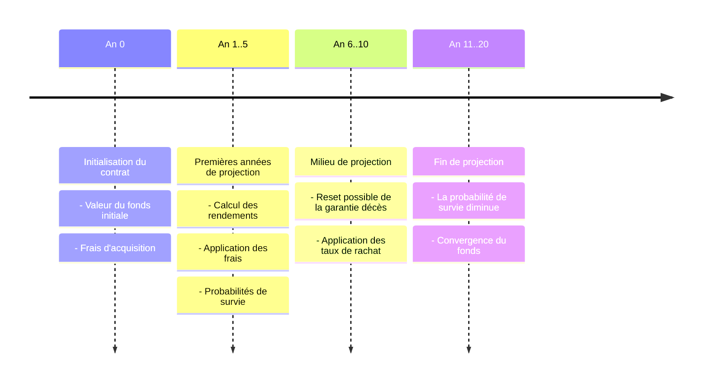
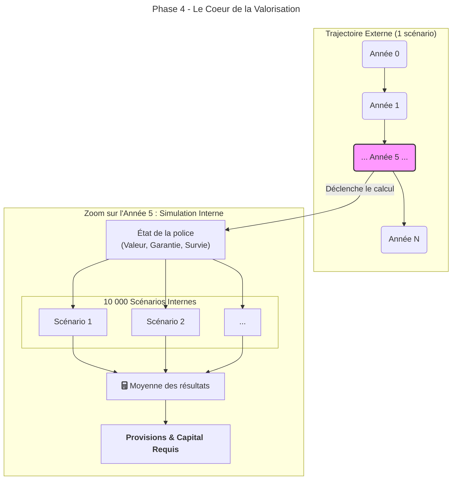
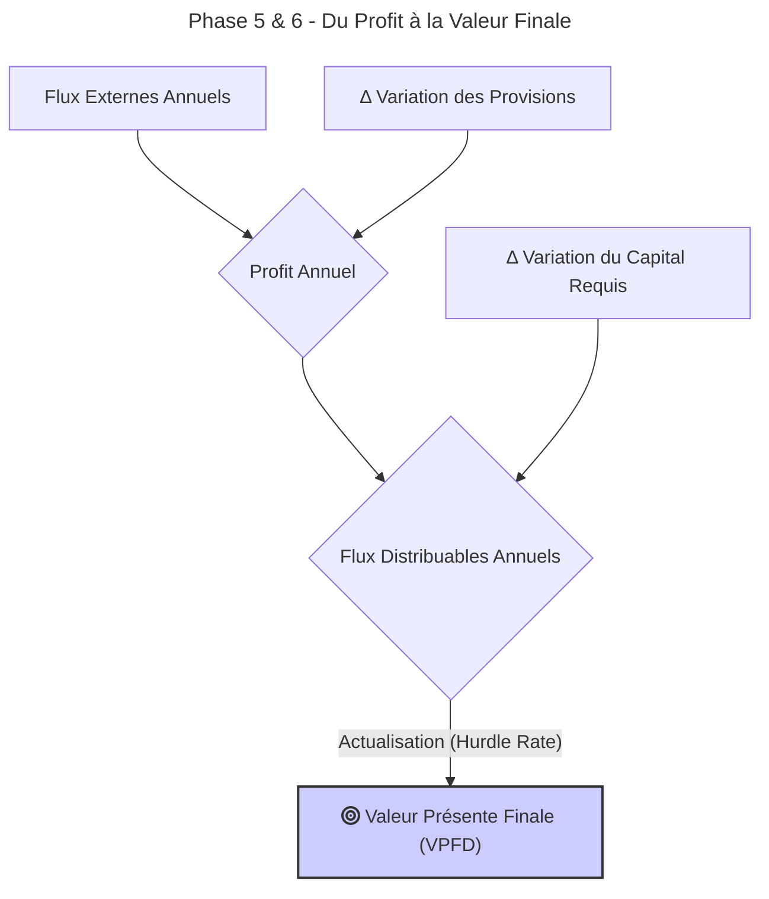
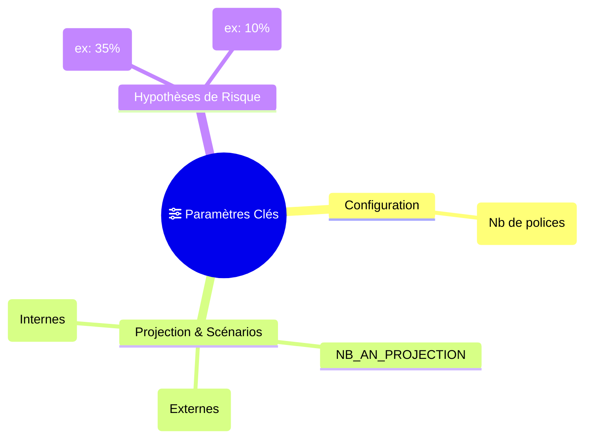

# Valorisation Actuarielle du Portefeuille par Simulation Stochastique

**Une approche Python pour le calcul de la Valeur Présente des Flux Distribuables**

**Date :** Octobre 2023  
**Présenté par :** [Votre Nom/Département]

---

## Notre Objectif : Transformer la Complexité en Valeur

L'objectif de cet algorithme est de calculer la valeur économique de notre portefeuille d'assurance-vie. Pour cela, nous utilisons une méthode de référence, dite "stochastique-sur-stochastique", qui simule des milliers de futurs possibles pour obtenir une évaluation robuste et fiable.

---

## Le Processus en 6 Étapes Clés

Notre approche suit un flux de travail structuré et transparent, garantissant la rigueur et la traçabilité du calcul, depuis la donnée brute jusqu'à la valorisation finale.

---

## Phase 1 & 2 : Une Fondation de Données Solide et Rapide

Avant tout calcul, nous chargeons toutes les données nécessaires (population, rendement, tables de mortalité...) et les transformons en tables de consultation optimisées. Cette étape est cruciale pour garantir des temps de calcul ultra-rapides.

---

## Phase 3 : Simulation Externe - La Trajectoire Future

Pour chaque police et chaque grand scénario économique, nous simulons une trajectoire future possible sur 20, 30 ans ou plus. Cette simulation projette l'évolution du contrat en tenant compte des rendements, des frais, des rachats et de la mortalité.

---

## Phase 4 : Simulation Interne - Le Cœur de la Valorisation

C'est l'étape la plus sophistiquée. À chaque année de la trajectoire externe, nous nous posons la question : "Quelle serait la valeur de nos engagements à cet instant futur ?" Pour y répondre, nous lançons des milliers de mini-simulations internes pour calculer deux métriques prudentielles :

- **Provisions (Réserves) :** La meilleure estimation de nos engagements.
- **Capital Requis :** La valeur des engagements en cas de crise financière.

---

## Phase 5 & 6 : Du Profit à la Valeur Finale

Enfin, nous combinons tous les éléments pour calculer la valeur pour l'actionnaire. Le flux distribuable est le profit généré, ajusté de la variation du capital à immobiliser. La somme actualisée de ces flux nous donne la valeur finale.

---

## Un Modèle Flexible et sous Contrôle

L'algorithme n'est pas une boîte noire. Il est entièrement piloté par des paramètres clés qui nous permettent de réaliser des analyses de sensibilité et des stress-tests.

---

## Résultats et Avantages Stratégiques

### Sortie Finale

Le résultat est une métrique claire et exploitable : la Valeur Présente des Flux Distribuables pour chaque police et chaque scénario.

| ID_COMPTE | scn_eval | VP_FLUX_DISTRIBUABLES |
|-----------|----------|-----------------------|
| C001      | 1        | 1,250.75 €            |
| C001      | 2        | -345.50 €             |
| C002      | 1        | 4,580.10 €            |

### Avantages Clés

🚀 **Performance :** Optimisé pour traiter des millions de projections rapidement.

🔍 **Transparence :** Un code modulaire et un processus traçable de bout en bout.

🎯 **Fidélité :** Conçu pour répliquer les modèles de référence, assurant la confiance dans les résultats.

🔧 **Flexibilité :** Permet des analyses de sensibilité pour des décisions stratégiques éclairées.

---

## Conclusion et Prochaines Étapes

Nous disposons maintenant d'un outil de valorisation robuste, rapide et moderne.

**Ce que nous avons :** Une capacité interne de valorisation actuarielle aux standards du marché.

**Ce que cela nous permet :** Des analyses fines pour la tarification, la gestion du capital, ou l'évaluation de portefeuilles (M&A).

### Prochaines Étapes :

1. Déploiement à grande échelle sur l'ensemble du portefeuille.
2. Réalisation d'analyses de sensibilité sur les paramètres clés.
3. Intégration des résultats dans nos processus de décision stratégique.