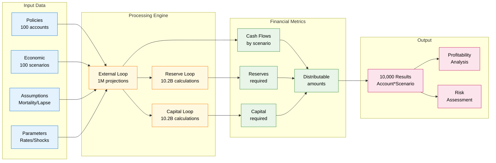
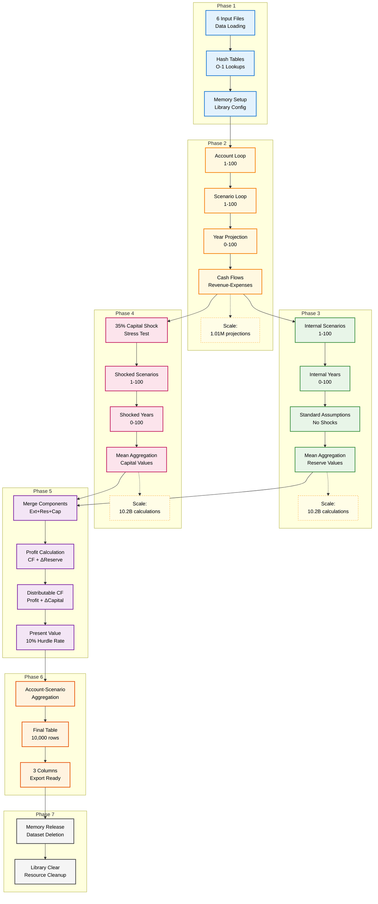

# Actuarial Cash Flow Calculation (ACFC) Algorithm

## Overview

The Actuarial Cash Flow Calculation algorithm is a comprehensive **Monte Carlo-based stochastic modeling system** designed for variable life insurance products with guaranteed death benefits. It calculates distributable cash flows to shareholders while accounting for policyholder obligations, regulatory capital requirements, and multiple risk factors.

## Product Type: Variable Universal Life Insurance

### **Core Product Features:**
- **Variable Fund Investment**: Policyholders invest in market-linked funds
- **Guaranteed Death Benefits**: Minimum death benefit guaranteed regardless of fund performance
- **Dynamic Guarantee Resets**: Death benefits can increase with favorable fund performance
- **Fee Structure**: Management fees charged on fund assets
- **Policy Decrements**: Policies terminate due to death or voluntary surrender (lapse)

### **Business Model:**
- **Revenue**: Investment management fees, administrative charges
- **Expenses**: Sales commissions, administrative costs, death benefit claims
- **Risk Exposure**: Mortality, lapse, investment, and guarantee risks
- **Capital Requirements**: Regulatory capital for solvency under stress scenarios

---

## Mathematical Foundation

### **1. Fund Value Projection**

The core fund value evolution follows a geometric progression with fees:

```
MT_VM(t+1) = MT_VM(t) × [1 + RENDEMENT(s,t) - PC_REVENU_FDS - FRAIS_ADJ(t)]

where:
- MT_VM(t) = Market value at time t
- RENDEMENT(s,t) = Investment return for scenario s at time t
- PC_REVENU_FDS = Fund management fee rate (annual)
- FRAIS_ADJ(t) = Additional fee adjustments
```

### **2. Survival Probability Modeling**

Multi-decrement model incorporating mortality and lapse risks:

```
TX_SURVIE(t+1) = TX_SURVIE(t) × [1 - Qx(age+t)] × [1 - WX(t)]

where:
- TX_SURVIE(t) = Survival probability at time t
- Qx(age+t) = Mortality rate at attained age (age_deb + t)
- WX(t) = Lapse rate at duration t
```

### **3. Death Benefit Guarantee Mechanism**

Dynamic guarantee with periodic resets:

```
MT_GAR_DECES(t) = MAX(MT_GAR_DECES(t-1), MT_VM(t)) 
                  if FREQ_RESET_DECES = 1 and age ≤ MAX_RESET_DECES

Death_Claim(t) = MAX(0, MT_GAR_DECES(t) - MT_VM(t)) × Qx(age+t) × TX_SURVIE(t-1)
```

### **4. Cash Flow Components**

**Revenue Streams:**
```
REVENUS(t) = -FRAIS(t) × TX_SURVIE(t-1)
where FRAIS(t) = -(MT_VM_DEB + RENDEMENT/2) × PC_REVENU_FDS
```

**Expense Streams:**
```
FRAIS_GEST(t) = -(MT_VM_DEB + RENDEMENT/2) × PC_HONORAIRES_GEST × TX_SURVIE(t-1)
COMMISSIONS(t) = -(MT_VM_DEB + RENDEMENT/2) × TX_COMM_MAINTIEN × TX_SURVIE(t-1)  
FRAIS_GEN(t) = -FRAIS_ADMIN × TX_SURVIE(t-1)
PMT_GARANTIE(t) = -Death_Claim(t)
```

**Net Cash Flow:**
```
FLUX_NET(t) = REVENUS(t) + FRAIS_GEST(t) + COMMISSIONS(t) + FRAIS_GEN(t) + PMT_GARANTIE(t)
```

### **5. Present Value Calculations**

Multi-stage discounting process:

```
VP_FLUX_NET(t) = FLUX_NET(t) × TX_ACTU(t)

where TX_ACTU(t) = discount factor from TX_INTERET table

For internal calculations:
VP_FLUX_NET_ADJ(t) = VP_FLUX_NET(t) / TX_ACTU_INT(eval_year)
```

---

## Algorithm Architecture

### **ACFC Pipeline Flow Diagram**

```mermaid
flowchart TD
    %% Input Layer
    A[Input Data Layer] --> A1[POPULATION<br/>Policy Data]
    A --> A2[TX_DECES<br/>Mortality Tables]
    A --> A3[TX_RETRAIT<br/>Lapse Rates]
    A --> A4[RENDEMENT<br/>Investment Scenarios]
    A --> A5[TX_INTERET<br/>External Discount Rates]
    A --> A6[TX_INTERET_INT<br/>Internal Discount Rates]
    
    %% Preprocessing
    A1 --> B[Preprocessing<br/>Hash Table Creation]
    A2 --> B
    A3 --> B
    A4 --> B
    A5 --> B
    A6 --> B
    
    %% External Loop
    B --> C[External Loop<br/>Level 1: Main Economic Scenarios]
    C --> C1[Account Loop<br/>100 Accounts]
    C1 --> C2[Scenario Loop<br/>100 Economic Scenarios]
    C2 --> C3[Year Loop<br/>0-100 Years]
    
    %% External Calculations
    C3 --> D[External Calculations]
    D --> D1[Fund Value Projection<br/>MT_VM with Return minus Fees]
    D1 --> D2[Death Benefit Updates<br/>MAX of Guarantee and Fund_Value]
    D2 --> D3[Survival Calculations<br/>S times mortality times lapse]
    D3 --> D4[Cash Flow Components<br/>Revenue - Expenses - Claims]
    D4 --> D5[Present Value<br/>CF times Discount_Factor]
    
    %% Store Results
    D5 --> E[Store External Results<br/>EXTERNAL_RESULTS Table]
    
    %% Internal Processing Branch
    E --> F{Internal Processing<br/>For Each External Result}
    
    %% Reserve Path
    F -->|Type 1| G[Reserve Calculations]
    G --> G1[Internal Scenario Loop<br/>100 Scenarios]
    G1 --> G2[Internal Year Loop<br/>0-100 Years]
    G2 --> G3[Standard Assumptions<br/>No Shocks Applied]
    G3 --> G4[Same Projection Logic<br/>as External Loop]
    G4 --> G5[Aggregate Results<br/>MEAN across scenarios]
    G5 --> H1[RESERVE Values]
    
    %% Capital Path  
    F -->|Type 2| I[Capital Calculations]
    I --> I1[Apply Capital Shock<br/>Fund_Value reduced by 35%]
    I1 --> I2[Internal Scenario Loop<br/>100 Scenarios]
    I2 --> I3[Internal Year Loop<br/>0-100 Years]
    I3 --> I4[Stressed Assumptions<br/>Shocked Fund Values]
    I4 --> I5[Same Projection Logic<br/>as External Loop]
    I5 --> I6[Aggregate Results<br/>MEAN across scenarios]
    I6 --> H2[CAPITAL Values]
    
    %% Integration
    H1 --> J[Final Integration]
    H2 --> J
    E --> J
    
    %% Final Calculations
    J --> K[Distributable Cash Flows]
    K --> K1[Calculate Profit<br/>External_CF + ΔReserve]
    K1 --> K2[Calculate Distributable<br/>Profit + ΔCapital]
    K2 --> K3[Present Value<br/>PV discounted at 10% per year]
    K3 --> K4[Aggregate by Account-Scenario<br/>SUM across all years]
    
    %% Output
    K4 --> L[Final Output<br/>SERVEUR.CALCULS_SOMMAIRE]
    L --> L1[10,000 Rows<br/>100 Accounts * 100 Scenarios]
    L1 --> L2[3 Columns<br/>ID_COMPTE, scn_eval, VP_FLUX_DISTRIBUABLES]
    
    %% Computational Scale Annotations
    C -.-> M1[Scale: 100*100*101<br/>= 1.01M base calculations]
    G -.-> M2[Scale: 1.01M*100*101<br/>= 10.2B reserve calculations]  
    I -.-> M3[Scale: 1.01M*100*101<br/>= 10.2B capital calculations]
    
    %% Styling
    classDef inputNode fill:#e1f5fe,stroke:#01579b,stroke-width:2px,color:#000000
    classDef processNode fill:#f3e5f5,stroke:#4a148c,stroke-width:2px,color:#000000
    classDef loopNode fill:#fff3e0,stroke:#e65100,stroke-width:2px,color:#000000
    classDef calcNode fill:#e8f5e8,stroke:#1b5e20,stroke-width:2px,color:#000000
    classDef outputNode fill:#fce4ec,stroke:#880e4f,stroke-width:2px,color:#000000
    classDef scaleNode fill:#f5f5f5,stroke:#424242,stroke-width:1px,stroke-dasharray: 5 5,color:#000000
    
    class A,A1,A2,A3,A4,A5,A6 inputNode
    class B,F,J processNode
    class C,C1,C2,C3,G1,G2,I2,I3 loopNode
    class D,D1,D2,D3,D4,D5,G3,G4,G5,I4,I5,I6,K,K1,K2,K3,K4 calcNode
    class E,H1,H2,L,L1,L2 outputNode
    class M1,M2,M3 scaleNode
```



### **Three-Tier Nested Stochastic Structure**

The pipeline implements a sophisticated **three-tier nested loop architecture**:

#### **🌊 Tier 1: External Economic Scenarios**
```
100 Accounts × 100 Economic Scenarios × 101 Years = 1,010,000 base projections
├─ Base mortality, lapse, and investment assumptions
├─ Primary cash flow projections under various economic conditions  
└─ Foundation for all subsequent calculations
```

#### **🏦 Tier 2: Reserve Calculations** 
```
For each of 1,010,000 external results:
├─ 100 Internal Scenarios × 101 Years = 10,100 sub-projections each
├─ Standard actuarial assumptions (no shocks applied)
├─ Total: 10.201 billion reserve calculations
└─ Mean aggregation produces required reserve estimates
```

#### **🛡️ Tier 3: Capital Calculations**
```  
For each of 1,010,000 external results:
├─ Apply 35% capital shock to starting fund values
├─ 100 Internal Scenarios × 101 Years = 10,100 sub-projections each  
├─ Total: 10.201 billion capital calculations
└─ Mean aggregation produces required capital estimates
```

### **Pipeline Characteristics**

| **Aspect** | **Specification** |
|------------|-------------------|
| **Total Computational Scale** | ~20.4 billion individual projections |
| **Memory Architecture** | Hash tables + segmented processing |
| **Parallelization Potential** | Account-level and scenario-level |
| **Critical Path** | Nested internal calculations (Tiers 2&3) |
| **Bottleneck** | Memory constraints from nested loops |
| **Output Reduction** | 20.4B calculations → 10K summary results |

### **Simplified Conceptual View**



### **Algorithm Phases Diagram**

```mermaid
gantt
    title ACFC Algorithm Execution Phases
    dateFormat X
    axisFormat %s
    
    section Phase 1: Initialization
    Load Input Files (6 files)     :milestone, m1, 0, 0
    Create Hash Tables              :active, init1, 0, 5
    Setup Memory Libraries          :init2, 5, 8
    
    section Phase 2: External Processing
    Account Loop Setup              :milestone, m2, 8, 8
    100 Accounts Processing         :active, ext1, 8, 40
    100 Economic Scenarios          :ext2, 8, 40  
    101 Years Projection            :ext3, 8, 40
    Cash Flow Calculations          :ext4, 20, 40
    Present Value Computation       :ext5, 35, 40
    
    section Phase 3: Reserve Calculations
    Internal Setup                  :milestone, m3, 40, 40
    For Each External Result        :active, res1, 40, 70
    100 Internal Scenarios          :res2, 40, 70
    101 Internal Years              :res3, 40, 70
    Aggregate Mean Results          :res4, 65, 70
    
    section Phase 4: Capital Calculations
    Apply 35% Shock                 :milestone, m4, 70, 70
    For Each External Result        :active, cap1, 70, 100
    100 Shocked Scenarios           :cap2, 70, 100
    101 Shocked Years               :cap3, 70, 100
    Aggregate Mean Results          :cap4, 95, 100
    
    section Phase 5: Integration
    Merge External + Internal       :milestone, m5, 100, 100
    Calculate Profit                :active, int1, 100, 110
    Calculate Distributable CF      :int2, 105, 110
    Present Value (10% Hurdle)      :int3, 108, 110
    
    section Phase 6: Output
    Aggregate by Account-Scenario   :milestone, m6, 110, 110
    Generate Final Table            :active, out1, 110, 115
    10,000 Results Export           :out2, 112, 115
    
    section Phase 7: Cleanup
    Memory Cleanup                  :milestone, m7, 115, 115
    Library Management              :active, clean1, 115, 118
```



### **Phase-by-Phase Computational Breakdown**



---

## Detailed Algorithm Steps

### **Phase 1: Initialization**

```
1. Load Input Data:
   - POPULATION: Policy characteristics (age, fund values, benefits)
   - TX_DECES: Mortality rates by age
   - TX_RETRAIT: Lapse rates by duration
   - RENDEMENT: Investment return scenarios
   - TX_INTERET: Discount rate structures
   
2. Create Hash Tables for O(1) lookups:
   - Mortality rates indexed by age
   - Lapse rates indexed by projection year
   - Investment returns indexed by (scenario, year, type)
   - Discount rates indexed by projection year
```

### **Phase 2: External Loop Processing**

```
FOR account = 1 to NBCPT (100):
    FOR scenario = 1 to NB_SC (100):
        FOR year = 0 to NB_AN_PROJECTION (100):
        
            IF year = 0:
                Initialize account values, survival rates, and cash flows
                Calculate initial commissions and acquisition expenses
                
            ELSE IF survival > 0 AND fund_value > 0:
                # Project fund value
                investment_return = LOOKUP(RENDEMENT, scenario, year)
                fund_growth = fund_value × investment_return
                fees = -(fund_value + fund_growth/2) × fee_rate
                fund_value = fund_value + fund_growth + fees
                
                # Update death benefit guarantee
                IF reset_frequency = annual AND age ≤ max_reset_age:
                    death_benefit = MAX(death_benefit, fund_value)
                
                # Calculate survival probabilities
                mortality_rate = LOOKUP(TX_DECES, current_age)
                lapse_rate = LOOKUP(TX_RETRAIT, year) 
                survival = survival × (1 - mortality_rate) × (1 - lapse_rate)
                
                # Calculate annual cash flows
                revenues = fund_fee_income × survival_beginning_year
                management_fees = fund_mgmt_charges × survival_beginning_year
                commissions = maintenance_commissions × survival_beginning_year
                admin_expenses = fixed_admin_costs × survival_beginning_year
                death_claims = MAX(0, death_benefit - fund_value) × mortality_rate × survival_beginning_year
                
                net_cash_flow = revenues + management_fees + commissions + admin_expenses + death_claims
                
                # Present value calculation
                discount_factor = LOOKUP(TX_INTERET, year)
                pv_cash_flow = net_cash_flow × discount_factor
                
            Store results for internal calculations
```

### **Phase 3: Internal Calculations - Reserves**

```
FOR each external result (account, scenario, year):
    Initialize: fund_value = external_fund_value, survival = external_survival
    
    FOR internal_scenario = 1 to NB_SC_INT (100):
        FOR internal_year = 0 to NB_AN_PROJECTION_INT (100):
            
            # Same projection logic as external loop
            # but using internal scenario assumptions
            
            Run fund projection, survival calculations, cash flows
            Calculate present values
            
    # Aggregate across internal scenarios
    RESERVE = MEAN(all internal scenario present values)
```

### **Phase 4: Internal Calculations - Capital**

```
FOR each external result (account, scenario, year):
    # Apply capital shock
    shocked_fund_value = external_fund_value × (1 - CHOC_CAPITAL)  # 35% shock
    Initialize: fund_value = shocked_fund_value, survival = external_survival
    
    FOR internal_scenario = 1 to NB_SC_INT (100):
        FOR internal_year = 0 to NB_AN_PROJECTION_INT (100):
            
            Run same projection logic with shocked starting values
            
    # Aggregate across internal scenarios  
    CAPITAL_REQUIREMENT = MEAN(all shocked scenario present values)
    NET_CAPITAL = CAPITAL_REQUIREMENT - RESERVE
```

### **Phase 5: Final Integration**

```
FOR each account-scenario combination:
    
    # Calculate distributable cash flows by year
    FOR each projection year:
        
        profit = external_cash_flow + (reserve_current - reserve_previous)
        distributable_amount = profit + (capital_current - capital_previous)
        
        # Present value to evaluation date using hurdle rate
        pv_distributable = distributable_amount / (1 + HURDLE_RT)^year
        
    # Aggregate across all years
    TOTAL_PV_DISTRIBUTABLE = SUM(all pv_distributable by year)
    
    Output: (ID_COMPTE, scn_eval, VP_FLUX_DISTRIBUABLES)
```

---

## Key Algorithm Properties

### **Computational Complexity**
- **Total Calculations**: ~10 billion individual projections
- **Matrix Dimensions**: 100 × 100 × 101 × 100 × 101 (accounts × ext_scenarios × ext_years × int_scenarios × int_years)
- **Memory Requirements**: Requires sophisticated memory management due to scale

### **Risk Modeling Features**
1. **Stochastic Investment Returns**: 100 economic scenarios
2. **Mortality Risk**: Age-dependent mortality tables
3. **Lapse Risk**: Duration-dependent surrender rates  
4. **Capital Adequacy**: 35% stress testing for regulatory compliance
5. **Guarantee Risk**: Dynamic death benefit guarantees

### **Financial Engineering Concepts**
1. **Nested Simulation**: Internal scenarios within external scenarios
2. **Risk-Neutral Valuation**: Multiple discount rate structures
3. **Capital Attribution**: Separates reserves from required capital
4. **Profit Emergence**: Year-by-year profit calculation with lag adjustments

---

## Output Interpretation

### **VP_FLUX_DISTRIBUABLES Values**

**Positive Values**: Indicate profitable account-scenario combinations where:
- Investment fee revenues exceed claim costs
- Mortality experience is favorable  
- Fund performance supports fee generation
- Required capital/reserves are manageable

**Negative Values**: Indicate loss scenarios where:
- High death benefit claims due to poor fund performance
- Elevated mortality or lapse rates
- Insufficient fee income to cover costs
- High capital requirements under stress

### **Business Applications**

1. **Product Pricing**: Understanding long-term profitability by scenario
2. **Capital Planning**: Determining required capital for solvency
3. **Risk Management**: Identifying scenarios with adverse outcomes
4. **Financial Reporting**: Calculating reserves and expected profits
5. **Strategic Planning**: Assessing product viability under various economic conditions

---

## Algorithm Validation

The algorithm incorporates several validation mechanisms:

### **Mathematical Consistency**
- Conservation of cash flows across projection periods
- Proper survival probability decrements
- Consistent present value calculations across nested loops

### **Actuarial Standards**
- Compliance with mortality table standards
- Appropriate lapse rate modeling
- Regulatory capital calculations (35% shock aligns with international standards)

### **Business Logic Validation**
- Death benefit guarantees cannot be negative
- Fund values properly account for fees and returns
- Survival probabilities bounded between 0 and 1

---

## Performance Considerations

### **Optimization Techniques**
1. **Hash Table Lookups**: O(1) access for rate tables
2. **Memory Management**: Strategic dataset segmentation
3. **Vectorized Operations**: Bulk processing where possible
4. **Early Termination**: Skip calculations when survival = 0

### **Scalability Factors**
- Algorithm scales linearly with number of accounts
- Exponential growth with scenario dimensions
- Memory requirements scale with projection horizon
- Processing time sensitive to nested loop depth

This algorithm represents a sophisticated implementation of modern actuarial modeling techniques for variable life insurance products, incorporating stochastic modeling, regulatory capital requirements, and comprehensive risk assessment frameworks.